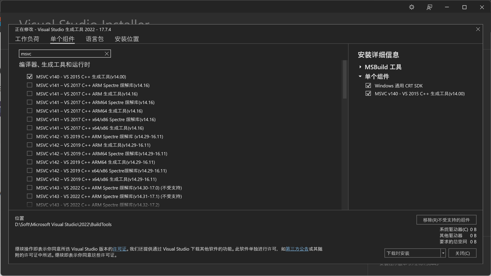

尝试 `pip install fairseq` 时若出现如下错误：
```
error: Microsoft Visual C++ 14.0 or greater is required. Get it with "Microsoft C++ Build Tools": https://visualstudio.microsoft.com/visual-cpp-build-tools/
```
1. 从 <https://aka.ms/vs/17/release/vs_BuildTools.exe> 下载 Visual Studio 生成工具。
2. 打开 `vs_BuildTools.exe` ，点击“单个组件”选项卡，搜索 `MSVC` 并勾选 `MSVC v140 - VS 2015 C++ 生成工具(v14.00)` 。
   
3. 选择一个喜欢的目录，安装。

安装完成后若继续出现如下错误：
```
LINK : fatal error LNK1158: 无法运行“rc.exe”
error: command 'C:\\Program Files (x86)\\Microsoft Visual Studio 14.0\\VC\\BIN\\x86_amd64\\link.exe' failed with exit code 1158
```
1. 将 `C:\Program Files (x86)\Windows Kits\10\bin\10.0.19041.0\x64\` 下的 `rc.exe` 与 `rcdll.dll` 复制到 `C:\Program Files (x86)\Microsoft Visual Studio 14.0\VC\bin\x86_amd64` 下。
2. 重新运行 `pip install fairseq` ，完成。
